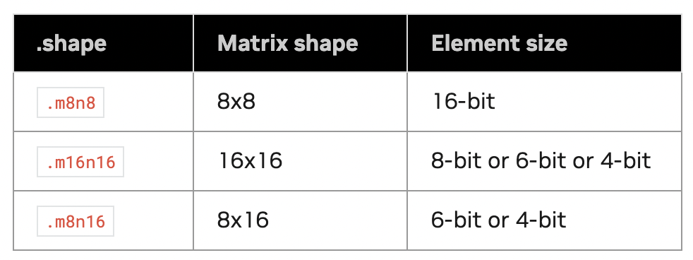

## mma

The [document](https://docs.nvidia.com/cuda/parallel-thread-execution/#warp-level-matrix-fragment-mma-1688) define the layout of A, B and C in instruction `mma.m16n8k8`.

## ldmatrix PTX instruction

In our solution, the PTX instruction `mma.sync.aligned.m16n8k8.row.col.f32.tf32.tf32.f32` is employed to compute a 16X8 tile with FP32 elements. Because each loading transaction can only read 4bytes X 32 = 128bytes, so we need four transanctions to load a tile with 16X8X4bytes = 512Bytes.

> Why each transaction can only loading 4bytes X 32 = 128bytes from shared memory to registers?
> The Nvidia GPU divide shared memory into 32 banks. And each bank services one 32-bit(4-byte) word per clock cycle.

`ldmatrix` is a warp-level matrix load instruction that can collectively load one or more matrices from shared memory for `mma` instruction. The instruction follows the syntax `ldmatrix.sync.aligned.shape.num{.trans}{.ss}.type r, [p];`, in which we need find appropriate `shape`, `num` and `type` for our task. 

As shown in the table below, three candidate shapes and their corresponding types are given.

The shape `.m8n8` with 16-bit element size can be used to load a 8X4 FP32 sub-tile in one transaction. And we can set `num=4` to load a 16X8 FP32 tile by 4 transactions in one instruction. Finally, we chose `ldmatrix.sync.aligned.x4.m8n8.shared.b16` for our task.

